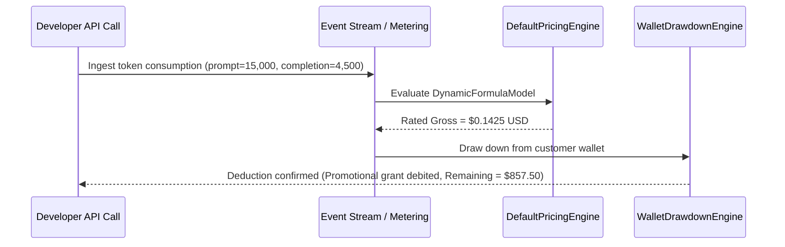

# Industry Use Cases & Application Guide: Enterprise Pricing Engine

This guide details the specific industries, operational models, and architectural patterns where the **Enterprise SaaS Pricing Engine** is deployed, with complete end-to-end code configurations and rating examples.

---

## 1. Industry Applicability Matrix

| Industry Vertical | Core Monetization Strategy | Key Engine Components Used |
| :--- | :--- | :--- |
| **Generative AI & LLM APIs** | Token usage formulas, prompt caching, GPU hypercubes, prepaid credit wallets | [`DynamicFormulaModel`](file:///Users/a.k.mmuhibullahnayem/Developer/pricing-engine/pricing-engine-core/src/main/java/com/saas/pricing/core/model/PricingModel.java#L202), [`DimensionalMatrixModel`](file:///Users/a.k.mmuhibullahnayem/Developer/pricing-engine/pricing-engine-core/src/main/java/com/saas/pricing/core/model/PricingModel.java#L171), [`WalletDrawdownEngine`](file:///Users/a.k.mmuhibullahnayem/Developer/pricing-engine/pricing-engine-core/src/main/java/com/saas/pricing/core/engine/WalletDrawdownEngine.java) |
| **Cloud Infrastructure & PaaS** | Multi-resource metering (vCPU-hours, GB-months), peak high-water mark, volume tiers, annual spend commitments | [`GraduatedTierModel`](file:///Users/a.k.mmuhibullahnayem/Developer/pricing-engine/pricing-engine-core/src/main/java/com/saas/pricing/core/model/PricingModel.java#L89), [`SpendCommitment`](file:///Users/a.k.mmuhibullahnayem/Developer/pricing-engine/pricing-engine-core/src/main/java/com/saas/pricing/core/model/wallet/SpendCommitment.java), [`AggregationType.MAX`](file:///Users/a.k.mmuhibullahnayem/Developer/pricing-engine/pricing-engine-metering/src/main/java/com/saas/pricing/metering/model/AggregationType.java) |
| **FinTech & Payment Orchestration** | Flat fee + basis points (% volume), multi-currency FX, zero-penny drift allocation, jurisdictional tax | [`CompositePricingModel`](file:///Users/a.k.mmuhibullahnayem/Developer/pricing-engine/pricing-engine-core/src/main/java/com/saas/pricing/core/model/PricingModel.java#L231), [`RemainderAllocator`](file:///Users/a.k.mmuhibullahnayem/Developer/pricing-engine/pricing-engine-core/src/main/java/com/saas/pricing/core/engine/RemainderAllocator.java), [`CurrencyExchangeProvider`](file:///Users/a.k.mmuhibullahnayem/Developer/pricing-engine/pricing-engine-core/src/main/java/com/saas/pricing/core/spi/CurrencyExchangeProvider.java) |
| **B2B SaaS & Product-Led Growth (PLG)** | Base subscription + included seats/allowance + overage + mid-cycle proration + feature gating | [`HybridModel`](file:///Users/a.k.mmuhibullahnayem/Developer/pricing-engine/pricing-engine-core/src/main/java/com/saas/pricing/core/model/PricingModel.java#L258), [`ProrationWindow`](file:///Users/a.k.mmuhibullahnayem/Developer/pricing-engine/pricing-engine-core/src/main/java/com/saas/pricing/core/model/ProrationWindow.java), [`EntitlementVerifier`](file:///Users/a.k.mmuhibullahnayem/Developer/pricing-engine/pricing-engine-core/src/main/java/com/saas/pricing/core/engine/EntitlementVerifier.java), [`HierarchicalRateCardResolver`](file:///Users/a.k.mmuhibullahnayem/Developer/pricing-engine/pricing-engine-core/src/main/java/com/saas/pricing/core/engine/HierarchicalRateCardResolver.java) |
| **Telecommunications, IoT & CPaaS** | Destination rate cards (country/carrier hypercube), unique active devices, out-of-order event streams | [`DimensionalMatrixModel`](file:///Users/a.k.mmuhibullahnayem/Developer/pricing-engine/pricing-engine-core/src/main/java/com/saas/pricing/core/model/PricingModel.java#L171), [`VolumeTierModel`](file:///Users/a.k.mmuhibullahnayem/Developer/pricing-engine/pricing-engine-core/src/main/java/com/saas/pricing/core/model/PricingModel.java#L116), [`AggregationType.DISTINCT_COUNT`](file:///Users/a.k.mmuhibullahnayem/Developer/pricing-engine/pricing-engine-metering/src/main/java/com/saas/pricing/metering/model/AggregationType.java) |

---

## 2. Detailed Industry Scenarios & Implementation Examples

### Scenario A: Generative AI API Platform (e.g. OpenAI / Anthropic Model)

#### Business Requirements:
1. Charge per token with different rates for input tokens, cached input tokens, and completion tokens.
2. Allow customers to purchase **prepaid credit packs** (e.g. \$1,000 grant).
3. Draw down promotional credits first before drawing down paid credits.
4. Block requests when credits are exhausted.



#### Code Implementation:

```java
// 1. Define Dynamic Token Formula in Rate Card
RatePlanItem llmRateItem = RatePlanItem.builder()
    .itemCode("LLM_INFERENCE")
    .pricingModel(PricingModel.DynamicFormulaModel.of(
        "(promptTokens * 0.000003) + (cachedTokens * 0.0000015) + (completionTokens * 0.000015)",
        "promptTokens", "cachedTokens", "completionTokens"
    ))
    .baseCurrency(CurrencyUnit.USD)
    .build();

// 2. Customer Wallet with Promotional ($100, expires in 30d) and Paid ($500) Credits
Wallet wallet = Wallet.create(TenantId.of("ai-corp"), CustomerId.of("dev-001"), CurrencyUnit.USD)
    .addGrant(CreditGrant.builder()
        .grantId("promo-grant")
        .name("Welcome Bonus")
        .grantType(GrantType.PROMOTIONAL)
        .initialAmount(BigDecimal.valueOf(100))
        .expiresAt(Instant.now().plus(Duration.ofDays(30)))
        .priority(10) // Highest priority: burns first
        .build())
    .addGrant(CreditGrant.builder()
        .grantId("paid-grant")
        .name("Prepaid Credit Pack")
        .grantType(GrantType.PREPAID)
        .initialAmount(BigDecimal.valueOf(500))
        .priority(50) // Burns after promo expires/exhausts
        .build());

// 3. Rate the request
PricingRequest request = PricingRequest.builder()
    .tenantId("ai-corp")
    .customerId("dev-001")
    .planCode("PAY_AS_YOU_GO")
    .item("LLM_INFERENCE", BigDecimal.ONE, Map.of(
        "promptTokens", 1_000_000,
        "cachedTokens", 500_000,
        "completionTokens", 200_000
    ))
    .build();

PricingResult result = pricingEngine.evaluate(request);
// result.finalTotal() -> $6.75 USD

// 4. Draw down credits
WalletDrawdownResult drawdown = walletEngine.drawdown(wallet, result.finalTotal(), result.calculationId());
```

---

### Scenario B: Cloud Infrastructure & Database-as-a-Service (e.g. AWS / Snowflake)

#### Business Requirements:
1. Egress Bandwidth billed via **Graduated Tiered Slabs** (first 10 TB @ \$0.08, next 40 TB @ \$0.06, >50 TB @ \$0.04).
2. Compute charged by **Peak High-Water Mark (`MAX`)** of concurrent database worker nodes in the billing cycle.
3. Minimum **Spend Commitment** of \$2,500/month: if total spend is \$1,800, assess a \$700 true-up shortfall fee.

#### Code Implementation:

```java
// 1. Graduated Bandwidth Slabs
PricingModel egressModel = PricingModel.GraduatedTierModel.of(
    Tier.of(BigDecimal.ZERO, BigDecimal.valueOf(10_000), BigDecimal.valueOf(0.08)),
    Tier.of(BigDecimal.valueOf(10_000), BigDecimal.valueOf(50_000), BigDecimal.valueOf(0.06)),
    Tier.unbounded(BigDecimal.valueOf(50_000), BigDecimal.valueOf(0.04))
);

// 2. Minimum Spend Commitment ($2,500)
SpendCommitment commitment = SpendCommitment.builder()
    .commitmentId("commit-2026")
    .minimumAmount(Money.of(2500, CurrencyUnit.USD))
    .effectiveFrom(Instant.parse("2026-01-01T00:00:00Z"))
    .effectiveTo(Instant.parse("2026-12-31T23:59:59Z"))
    .action(SpendCommitment.ShortfallAction.ASSESS_TRUE_UP)
    .build();

// 3. Evaluating 25,000 GB egress and 8 Peak Nodes
PricingRequest request = PricingRequest.builder()
    .tenantId("cloud-platform")
    .customerId("enterprise-acct-88")
    .planCode("INFRA_V2")
    .item("EGRESS_GB", BigDecimal.valueOf(25_000)) // 10,000*0.08 ($800) + 15,000*0.06 ($900) = $1,700
    .item("PEAK_NODES", BigDecimal.valueOf(8))    // 8 nodes * $25/node = $200
    .build();

PricingResult result = pricingEngine.evaluate(request);
// Net Usage = $1,900 USD
// Commitment shortfall detected: True-up charge = $600 USD
// result.finalTotal() -> $2,500 USD (Includes auto-generated COMMITMENT_TRUE_UP line item)
```

---

### Scenario C: FinTech & Payment Orchestration (e.g. Stripe / Adyen)

#### Business Requirements:
1. Transaction fee = **Composite Model**: \$0.30 fixed fee + 2.9% transaction value.
2. Cross-border settlement: Calculate in EUR or GBP with point-in-time **FX conversion rates**.
3. Volume coupon discount (\$50.00 off invoice total) distributed across multiple customer merchant sub-accounts with **zero penny rounding drift** (Hamilton-Hare Remainder Allocation).

#### Code Implementation:

```java
// Apportioning a $10.00 total invoice discount across 3 transactions:
// Transaction 1: $100.00 (weight 100)
// Transaction 2: $200.00 (weight 200)
// Transaction 3: $300.00 (weight 300)
Money totalDiscount = Money.of(10, CurrencyUnit.USD);
List<BigDecimal> weights = List.of(BigDecimal.valueOf(100), BigDecimal.valueOf(200), BigDecimal.valueOf(300));

List<Money> allocated = RemainderAllocator.allocate(totalDiscount, weights);
// Item 1: $1.67 USD
// Item 2: $3.33 USD
// Item 3: $5.00 USD
// Sum: $1.67 + $3.33 + $5.00 = EXACTLY $10.00 USD (0.00 penny drift)
```

---

### Scenario D: Modern B2B SaaS Subscriptions & Mid-Cycle Proration (e.g. Slack / Figma)

#### Business Requirements:
1. **Hybrid Plan**: \$499.00/month base subscription includes 20 seats.
2. Overage: Additional seats above 20 billed at \$25.00/seat/month.
3. Mid-month seat upgrade: Customer adds 10 extra seats on Day 15 of a 30-day month $\implies$ 50% proration factor ($0.50$).
4. Real-time **Entitlements**: Soft limit allows overages with warnings; Hard limit stops seat creation.

#### Code Implementation:

```java
// 1. Hybrid Rate Item: Base Fee + Allowance + Overage
RatePlanItem seatItem = RatePlanItem.builder()
    .itemCode("SEATS")
    .pricingModel(PricingModel.HybridModel.of(
        Money.of(499, CurrencyUnit.USD), // Base subscription
        BigDecimal.valueOf(20),          // 20 seats included free
        PricingModel.PerUnitModel.of(BigDecimal.valueOf(25)) // $25/seat overage
    ))
    .proratable(true)
    .baseCurrency(CurrencyUnit.USD)
    .build();

// 2. Mid-cycle proration window (15 days out of 30 days)
ProrationWindow window = ProrationWindow.of(
    Instant.parse("2026-06-15T00:00:00Z"),
    Instant.parse("2026-06-30T23:59:59Z"),
    Instant.parse("2026-06-01T00:00:00Z"),
    Instant.parse("2026-06-30T23:59:59Z")
);

PricingRequest request = PricingRequest.builder()
    .tenantId("saas-corp")
    .planCode("TEAM_PLAN")
    .item("SEATS", BigDecimal.valueOf(30)) // 30 seats total (10 overage seats)
    .prorationWindow(window)               // ~50% of the month
    .build();

PricingResult result = pricingEngine.evaluate(request);
// Base ($499) + 10 overage seats * $25 ($250) = $749 gross
// Prorated at 50%: finalTotal = $374.50 USD
```

---

### Scenario E: Telecommunications, CPaaS & IoT (e.g. Twilio / Particle IoT)

#### Business Requirements:
1. Message routing matrix: rate depends on `countryCode`, `carrier`, and `channel` (`SMS` vs `MMS`).
2. IoT Fleet: Bill per **Unique Connected SIM Card (`DISTINCT_COUNT`)** active in the network window.
3. Automatic fallback: If carrier not matched, fallback to default country rate.

#### Code Implementation:

```java
// Multi-attribute Dimensional Matrix
PricingModel smsMatrix = PricingModel.DimensionalMatrixModel.of(
    List.of("country", "carrier", "channel"),
    List.of(
        MatrixEntry.of(Map.of("country", "US", "carrier", "VERIZON", "channel", "SMS"), PricingModel.PerUnitModel.of(BigDecimal.valueOf(0.0075))),
        MatrixEntry.of(Map.of("country", "US", "carrier", "ATT", "channel", "SMS"), PricingModel.PerUnitModel.of(BigDecimal.valueOf(0.0080))),
        MatrixEntry.of(Map.of("country", "US", "channel", "SMS"), PricingModel.PerUnitModel.of(BigDecimal.valueOf(0.0090))) // Wildcard fallback
    ),
    PricingModel.PerUnitModel.of(BigDecimal.valueOf(0.0150)) // Global fallback
);
```

---

## 3. How to Integrate into Any Spring Boot SaaS Application

### Maven Dependency
```xml
<dependency>
    <groupId>com.saas.pricing</groupId>
    <artifactId>pricing-engine-spring-boot-starter</artifactId>
    <version>1.0.0-SNAPSHOT</version>
</dependency>
```

### Configuration (`application.yml`)
```yaml
pricing:
  engine:
    enabled: true
    persistence-type: JDBC          # Use PostgreSQL JDBC repositories
    default-currency: USD
    enable-audit: true
    rounding-mode: HALF_EVEN
    streaming:
      enabled: true
      async-rating-enabled: true
```

### Injection & Usage
```java
@RestController
@RequestMapping("/billing")
public class AppBillingController {

    private final EnterprisePricingService pricingService;
    private final UsageMeteringEngine meteringEngine;

    public AppBillingController(EnterprisePricingService pricingService, UsageMeteringEngine meteringEngine) {
        this.pricingService = pricingService;
        this.meteringEngine = meteringEngine;
    }

    @PostMapping("/calculate")
    public PricingResult computeInvoice(@RequestBody PricingRequest request) {
        return pricingService.evaluate(request);
    }
}
```
