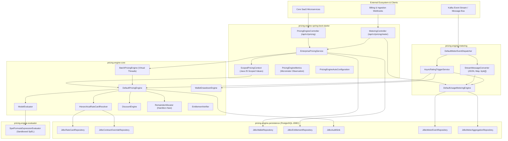
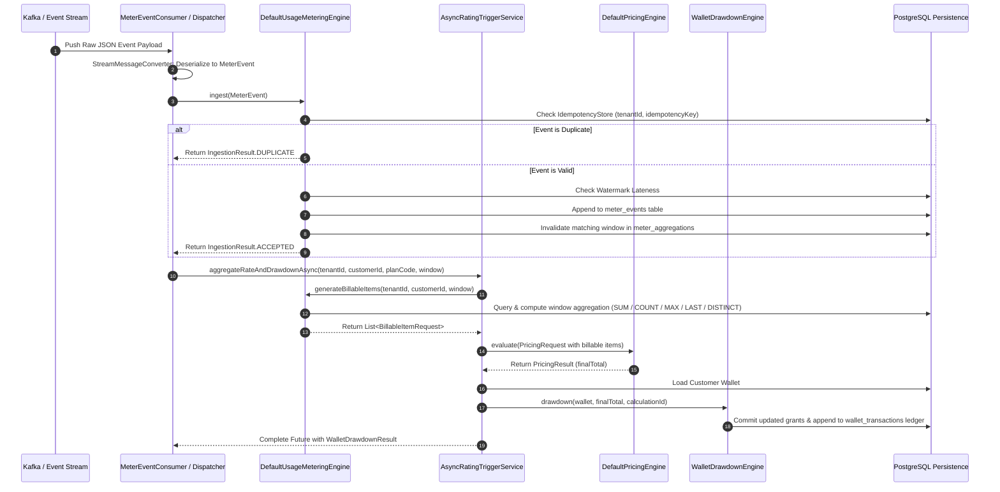
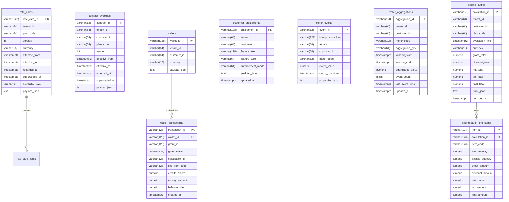

# Detailed System Architecture Specification

A technical deep-dive into the architectural foundations, component interactions, database schemas, and data pipelines of the **Enterprise SaaS Pricing Engine**.

---

## 1. End-to-End Component Topology



---

## 2. Evaluation Pipeline Lifecycle (Directed Acyclic Graph)

Every invoice calculation or usage rating executes through a deterministic, idempotent, fully traceable pipeline:

```mermaid
flowchart TD
    Req["Incoming PricingRequest"] --> Resolve["Hierarchical Rate Card Resolution<br/>(Contract Override &gt; Account Default &gt; Global Catalog)"]
    Resolve --> CheckBiTemp["Bi-Temporal Validation<br/>(effectiveTime within [effectiveFrom, effectiveTo]<br/>AND systemTime valid)"]
    CheckBiTemp --> ExtractItems["Iterate BillableItemRequest Items"]
    ExtractItems --> BillableQty["Compute Billable Quantity<br/>(Apply included units / conversion factors)"]
    BillableQty --> EvaluateModel["ModelEvaluator: Evaluate PricingModel<br/>(Slabs, Cliffs, Packages, Matrix, Dynamic Formula, Hybrid)"]
    EvaluateModel --> Prorate["Time-Window Proration<br/>(Exact second/day ratio application)"]
    Prorate --> FXConvert["FX Currency Conversion<br/>(Exchange rate at evaluationTime)"]
    FXConvert --> LineDiscount["Apply Line-Item Discounts<br/>(WATERFALL, COMPOUND, ADDITIVE, EXCLUSIVE)"]
    LineDiscount --> LineTax["Jurisdictional Tax Calculation<br/>(State, City, VAT/GST)"]
    LineTax --> Subtotal["Aggregate Line Items & Compute Gross Subtotal"]
    Subtotal --> InvDiscount["Apply Invoice-Level Discounts"]
    InvDiscount --> RemainderAlloc["Hamilton-Hare Remainder Allocation<br/>(Zero penny-drift apportionment down to line items)"]
    RemainderAlloc --> SpendCommit["Spend Commitment Verification<br/>(Assess shortfall true-up if net &lt; minimum)"]
    SpendCommit --> Result["Generate Immutable PricingResult<br/>(Includes complete EvaluationTrace)"]
    Result --> Audit["Persist to AuditSink & Record Micrometer Metrics"]
```



---

## 3. Asynchronous Stream Ingestion & Rating Sequence Diagram

The interaction model when raw telemetry events arrive over event streams (Kafka, RabbitMQ, SQS):



---

## 4. Entity-Relationship & Relational Database Schema

The production schema (`pricing-engine-persistence`) implemented for PostgreSQL:



---

## 5. Concurrency & High-Throughput Loom Architecture

### Java 25 Project Loom Virtual Threads
* High-volume batch requests evaluated via [`BatchPricingEngine`](file:///Users/a.k.mmuhibullahnayem/Developer/pricing-engine/pricing-engine-core/src/main/java/com/saas/pricing/core/engine/BatchPricingEngine.java) using `Executors.newVirtualThreadPerTaskExecutor()`.
* Virtual threads allow thousands of concurrent pricing calculations without thread pool starvation or context-switching penalties.
* Memory footprint per virtual thread is hundreds of bytes, enabling near-instantaneous scaling on multicore nodes.

### Java 25 Scoped Values Context Management
* Traditional `ThreadLocal` storage suffers from memory leaks and inheritance overhead in virtual thread architectures.
* [`ScopedPricingContext`](file:///Users/a.k.mmuhibullahnayem/Developer/pricing-engine/pricing-engine-spring-boot-starter/src/main/java/com/saas/pricing/starter/context/ScopedPricingContext.java) utilizes Java 25 `ScopedValue` (`ScopedValue<PricingContext>`) to pass immutable tenant credentials, customer IDs, and audit correlation IDs cleanly down the calculation call tree:

```java
ScopedPricingContext.runWith(tenantId, customerId, correlationId, () -> {
    return pricingEngine.evaluate(request);
});
```
